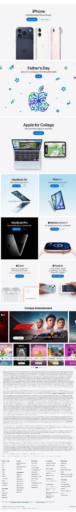

# Apple Website Clone

A responsive Apple website clone created as a frontend development practice project. The project focuses on recreating the layout, styling, and visual structure of an Apple-style website using HTML and CSS.

## 📸 Screenshot



## 🚀 Features

- Responsive website layout
- Apple-inspired navigation bar
- Product sections
- Hero sections
- Clean and modern UI
- Responsive styling for different screen sizes
- Organized HTML and CSS structure

## 🛠️ Technologies Used

- HTML5
- CSS3

## 📂 Project Structure

```text
apple-website-clone/
│
├── css/
│   └── style.css
│
├── images/
│   └── project images
│
├── index.html
├── SCREENSHOT.jpg
└── .gitignore
